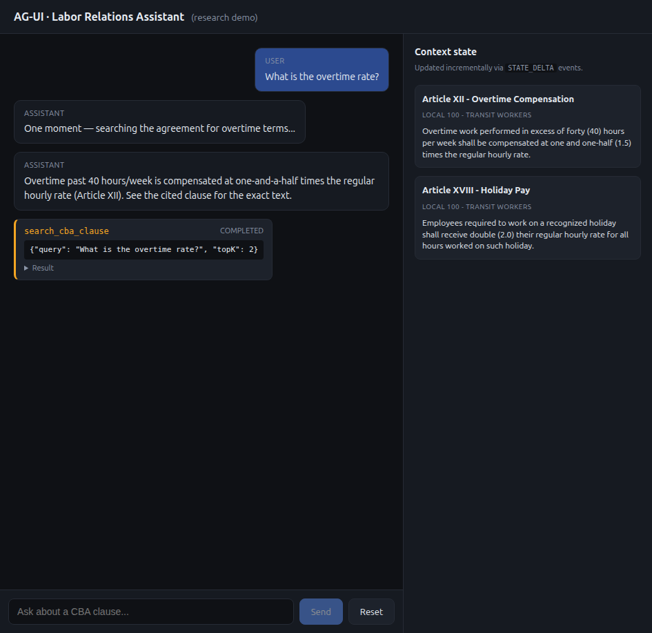
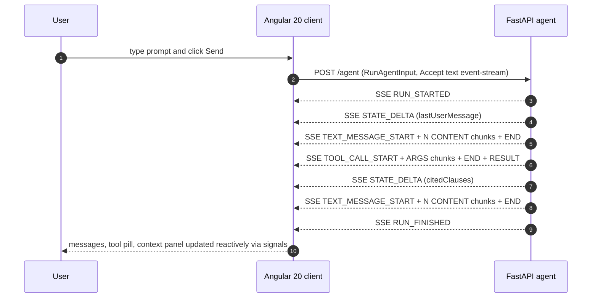

# creai-techresearch-ag-ui-angular

Research demo exploring the [**AG-UI Protocol**](https://github.com/ag-ui-protocol/ag-ui)
with an Angular 20 standalone client, applied to the future Labor Relations
Assistant of the Vensure / Creai labor-relations product.

> Jira ticket: [TR-306](https://creai.atlassian.net/browse/TR-306) — *AG-UI Protocol + Angular 20: streaming agent client for the Labor Relations Chat*

## Why this matters

The Vensure Labor Relations frontend (`creai_labor-relations-front`) ships a
**Chat tab whose transport today is a synchronous REST request/response backed by
gRPC** (`POST /api/v1/conversations/{id}/messages` → NL2Q + Answer Generation
gRPC services, returning the full answer at once — see VN-54). The roadmap calls
for a real *Labor Relations Assistant* that answers questions about Collective
Bargaining Agreements (CBAs) over that same graph + retrieval pipeline.

AG-UI (Agent-User Interaction) is the open, event-based protocol that bridges
**any agent backend** with **any agent-aware frontend**, over plain HTTP + SSE.
It is maintained by CopilotKit and adopted by Google, Microsoft, LangChain, AWS,
CrewAI and Mastra. It standardises token streaming, visible tool calls and
incremental state updates — exactly what turns a blocking chat into a responsive,
agentic one.

This repo asks: *if we adopt AG-UI today, what does the integration look like
from the Angular side, and how does it compare to the synchronous REST + gRPC
chat Vensure ships now?*

> **Note on the Angular client.** A spike (S2) disproved the original premise:
> there is **no first-party Angular client** — `@copilotkit/angular` /
> `@ag-ui/angular` do not exist on npm (CopilotKit is React-only). The supported
> pattern is the framework-agnostic **`@ag-ui/client`** `HttpAgent` (transport,
> event verification, JSON-Patch state) plus a small custom Angular **signals**
> layer. This demo uses exactly that.

## What is in the box

A minimal end-to-end demo:

- `apps/api/` — FastAPI server with a single `POST /agent` endpoint that emits
  AG-UI events over Server-Sent Events. The agent is deterministic by default:
  it routes each message to a Labor-Relations intent (overtime, holiday,
  seniority, grievance, leave) and returns a randomly-varied answer plus a
  `search_cba_clause` tool call and per-intent cited clauses, pushed to a shared
  state via JSON-Patch. An optional `USE_LLM=1` path streams the final answer
  from a small local [Ollama](https://ollama.com) model, with the pool as a safe
  fallback. See [`apps/api/README.md`](apps/api/README.md).
- `apps/web/` — Angular 20 standalone client. Zoneless change detection.
  Signal-based state. `AgentService` is a thin glue over `@ag-ui/client`'s
  `HttpAgent`, mirroring the streamed events into signals:
  - `messages()` — chat messages with token-by-token streaming
  - `toolCalls()` — tool invocations with intermediate status
  - `agentState()` — shared context state updated via `STATE_DELTA` events
- `docs/architecture.md` — runtime flow, sequence diagram, event→signal reducer.
- `docs/vensure-integration.md` — comparison against the **real** chat baseline
  (synchronous REST + gRPC, VN-54) and the recommendation.
- `docs/sprint-7-sessions.md` — the authoritative execution plan.

## Demo



## Quick start

Prerequisites: Python 3.12+, Node.js 20.19+ (or 22.12+), npm 10+.

```bash
git clone https://github.com/fenimorebaena-creai/creai-techresearch-ag-ui-angular.git
cd creai-techresearch-ag-ui-angular

make install      # creates apps/api/.venv and runs npm install in apps/web

# In two terminals:
make dev-api      # → FastAPI on http://localhost:8001 (override with PORT=)
make dev-web      # → Angular  on http://localhost:4200
```

Open <http://localhost:4200>, type a question (e.g. *"What is the overtime
rate?"*) and watch:

1. The user message appear immediately
2. The assistant message stream token by token
3. A `search_cba_clause` tool pill appear with running → completed states
4. The right-hand context panel populate with the cited CBA clauses as
   `STATE_DELTA` events are applied

You can press **Stop** mid-stream to abort the run, or **Reset** to clear the
thread.

## Event coverage

```
RUN_STARTED
  STATE_DELTA            (lastUserMessage)
  TEXT_MESSAGE_START
  TEXT_MESSAGE_CONTENT × N
  TEXT_MESSAGE_END
  TOOL_CALL_START
  TOOL_CALL_ARGS   × N
  TOOL_CALL_END
  TOOL_CALL_RESULT
  STATE_DELTA            (citedClauses)
  TEXT_MESSAGE_START
  TEXT_MESSAGE_CONTENT × N
  TEXT_MESSAGE_END
RUN_FINISHED
```

`RUN_ERROR` is emitted on failure and surfaced as the UI error state.
Out of scope for the demo: `STATE_SNAPSHOT`, `MESSAGES_SNAPSHOT`, `RAW`,
`CUSTOM`, human-in-the-loop interrupts, multi-thread branching.

## Architecture (high level)



`@ag-ui/client`'s `HttpAgent` owns the POST + SSE transport, event-sequence
verification and JSON-Patch state reduction; `AgentService` subscribes and
mirrors the result into Angular signals. See
[`docs/architecture.md`](docs/architecture.md) for the full reducer table and
detailed flow.

## Decision log

**Recommendation: investigate further with a small, time-boxed integration
spike** (1 sprint, 1 FE + 1 BE). AG-UI is a *UX upgrade* to a working
synchronous chat — streaming text, visible tool progress, incremental evidence,
cancellation and human-in-the-loop — not a fix for a broken transport, so the
decision hinges on the streaming infrastructure validating in staging.

Key findings (full analysis in [`docs/vensure-integration.md`](docs/vensure-integration.md)):

- **Client:** use `@ag-ui/client` `HttpAgent` + a thin Angular signals layer.
  No first-party Angular client exists. (`@ag-ui/client` is pre-1.0 v0.0.56 —
  pin it and budget for churn.)
- **Hard blocker to clear:** SSE behind PrismHR / PrismOne ingress (Azure App
  Gateway / nginx `proxy_buffering`) is unvalidated. If SSE cannot stream through
  staging, keep the synchronous REST chat and revisit.
- **Baseline corrected:** the chat today is synchronous REST + gRPC, *not* the
  `/api/v1/ws` WebSocket (that carries document-upload jobs and is a separate
  concern).

## Layout

```text
.
├── apps/
│   ├── api/                FastAPI mock AG-UI emitter
│   │   ├── pyproject.toml
│   │   ├── README.md
│   │   ├── src/
│   │   │   ├── events.py     AG-UI event builders + SSE formatter
│   │   │   ├── responses.py  intent routing + per-intent answers/clauses pool
│   │   │   ├── llm.py        optional Ollama streaming path (USE_LLM)
│   │   │   └── main.py       /agent SSE endpoint + mock run loop
│   │   └── tests/            event-sequence + intent-routing tests
│   └── web/                Angular 20 standalone client
│       ├── package.json
│       └── src/app/
│           ├── app.config.ts
│           ├── app.component.ts
│           └── chat/
│               ├── ag-ui.types.ts     UI-facing types
│               ├── agent.service.ts   thin signals glue over @ag-ui/client HttpAgent
│               ├── chat.component.ts   UI host
│               ├── chat.component.html
│               └── chat.component.css
├── docs/
│   ├── architecture.md
│   ├── vensure-integration.md   AG-UI vs REST+gRPC chat baseline + recommendation
│   ├── sprint-7-sessions.md     authoritative execution plan
│   ├── research-plan.md         original 30-day plan (obsolete, kept for history)
│   ├── screenshots/
│   └── days/                    superseded per-day plans
├── scripts/dev.sh          runs api + web together
├── Makefile
├── LICENSE
└── README.md
```

## References

- AG-UI Protocol specification: <https://github.com/ag-ui-protocol/ag-ui>
- AG-UI docs (HttpAgent, event types): <https://docs.ag-ui.com>
- CopilotKit (AG-UI maintainers): <https://github.com/CopilotKit/CopilotKit>
- Angular Resource API (signals + streaming):
  <https://github.com/angular/angular/blob/main/packages/core/src/resource/api.ts>
- Server-Sent Events (WHATWG): <https://html.spec.whatwg.org/multipage/server-sent-events.html>
- RFC 6902 (JSON Patch): <https://www.rfc-editor.org/rfc/rfc6902>

## License

MIT — see [`LICENSE`](LICENSE).
