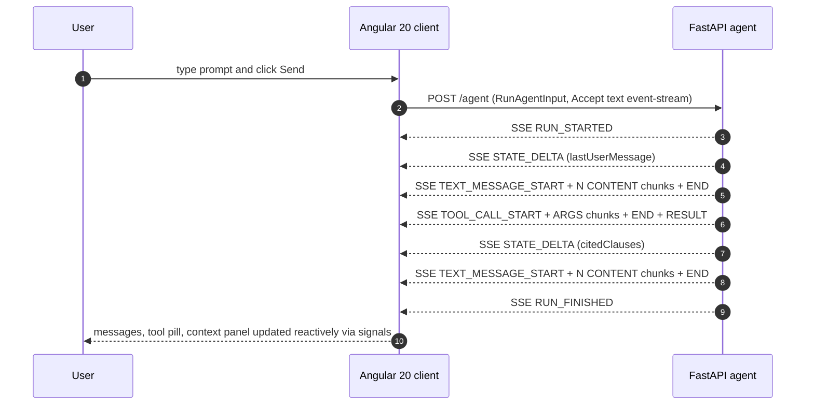

# creai-techresearch-ag-ui-angular

Research demo exploring the [**AG-UI Protocol**](https://github.com/ag-ui-protocol/ag-ui)
with an Angular 20 standalone client, applied to the future Labor Relations
Assistant of the Vensure / Creai labor-relations product.

> Jira ticket: [TR-306](https://creai.atlassian.net/browse/TR-306) — *AG-UI Protocol + Angular 20: streaming agent client for the Labor Relations Chat*

## Why this matters

The Vensure Labor Relations frontend (`creai_labor-relations-front`) ships a **Chat
tab that is currently mocked**. The roadmap calls for a real *Labor Relations
Assistant* that answers questions about Collective Bargaining Agreements (CBAs)
and consumes the graph + retrieval pipeline served by the `ai-*` gRPC services.

AG-UI (Agent-User Interaction) is the open, event-based protocol that bridges
**any agent backend** with **any agent-aware frontend**, over plain HTTP + SSE.
It is maintained by CopilotKit and adopted by Google, Microsoft, LangChain, AWS,
CrewAI and Mastra. Critically, CopilotKit ships a first-party **Angular client**
that maps AG-UI events directly to Angular Signals and the new Resource API in
Angular 20.

This repo asks: *if we adopt AG-UI today, what does the integration look like
from the Angular side, and how does it compare to the WebSocket pattern Vensure
already uses for upload/structure jobs?*

## What is in the box

A minimal end-to-end demo:

- `apps/api/` — FastAPI server with a single `POST /agent` endpoint that emits
  AG-UI events over Server-Sent Events. The agent is a deterministic mock that
  answers a Labor Relations question, performs one `search_cba_clause` tool
  call, and pushes incremental updates to a shared state via JSON-Patch.
- `apps/web/` — Angular 20 standalone client. Zoneless change detection.
  Signal-based state. Reduces the AG-UI event stream into:
  - `messages()` — chat messages with token-by-token streaming
  - `toolCalls()` — tool invocations with intermediate status
  - `agentState()` — shared context state updated via `STATE_DELTA` events
- `docs/architecture.md` — request/response flow with sequence diagram.
- `docs/vensure-integration.md` — comparison against the current WebSocket
  pattern in `creai_labor-relations`, and recommendation.

## Quick start

Prerequisites: Python 3.12+, Node.js 20.19+ (or 22.12+), npm 10+.

```bash
git clone https://github.com/fenimorebaena-creai/creai-techresearch-ag-ui-angular.git
cd creai-techresearch-ag-ui-angular

make install      # creates apps/api/.venv and runs npm install in apps/web

# In two terminals:
make dev-api      # → FastAPI on http://localhost:8001 (override with PORT=)
make dev-web      # → Angular  on http://localhost:4200
```

Open <http://localhost:4200>, type a question (e.g. *"What is the overtime
rate?"*) and watch:

1. The user message appear immediately
2. The assistant message stream token by token
3. A `search_cba_clause` tool pill appear with running → completed states
4. The right-hand context panel populate with the cited CBA clauses as
   `STATE_DELTA` events are applied

## Event coverage

```
RUN_STARTED
  STATE_DELTA            (lastUserMessage)
  TEXT_MESSAGE_START
  TEXT_MESSAGE_CONTENT × N
  TEXT_MESSAGE_END
  TOOL_CALL_START
  TOOL_CALL_ARGS   × N
  TOOL_CALL_END
  TOOL_CALL_RESULT
  STATE_DELTA            (citedClauses)
  TEXT_MESSAGE_START
  TEXT_MESSAGE_CONTENT × N
  TEXT_MESSAGE_END
RUN_FINISHED
```

Out of scope for the demo: `MESSAGES_SNAPSHOT`, `STATE_SNAPSHOT`, `RAW`,
`CUSTOM`, human-in-the-loop interrupts, multi-thread branching.

## Architecture (high level)



See [`docs/architecture.md`](docs/architecture.md) for the full reducer table
and detailed flow.

## Decision log

Filled in during Phase 3 of the research plan. See
[`docs/vensure-integration.md`](docs/vensure-integration.md).

## Layout

```text
.
├── apps/
│   ├── api/                FastAPI mock AG-UI emitter
│   │   ├── pyproject.toml
│   │   ├── src/
│   │   │   ├── events.py   AG-UI event builders + SSE formatter
│   │   │   └── main.py     /agent SSE endpoint + mock run loop
│   │   └── tests/          smoke test for the event sequence
│   └── web/                Angular 20 standalone client
│       ├── package.json
│       └── src/app/
│           ├── app.config.ts
│           ├── app.component.ts
│           └── chat/
│               ├── ag-ui.types.ts    typed event union
│               ├── agent.service.ts  fetch + SSE parser + signal reducer
│               ├── chat.component.ts UI host
│               ├── chat.component.html
│               └── chat.component.css
├── docs/
│   ├── architecture.md
│   └── vensure-integration.md
├── scripts/dev.sh          runs api + web together
├── Makefile
├── LICENSE
└── README.md
```

## References

- AG-UI Protocol specification: <https://github.com/ag-ui-protocol/ag-ui>
- AG-UI docs (HttpAgent, event types): <https://docs.ag-ui.com>
- CopilotKit (AG-UI maintainers, Angular client): <https://github.com/CopilotKit/CopilotKit>
- Angular Resource API (signals + streaming):
  <https://github.com/angular/angular/blob/main/packages/core/src/resource/api.ts>
- Server-Sent Events (WHATWG): <https://html.spec.whatwg.org/multipage/server-sent-events.html>
- RFC 6902 (JSON Patch): <https://www.rfc-editor.org/rfc/rfc6902>

## License

MIT — see [`LICENSE`](LICENSE).
