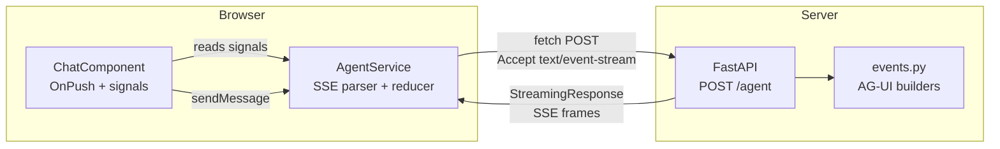
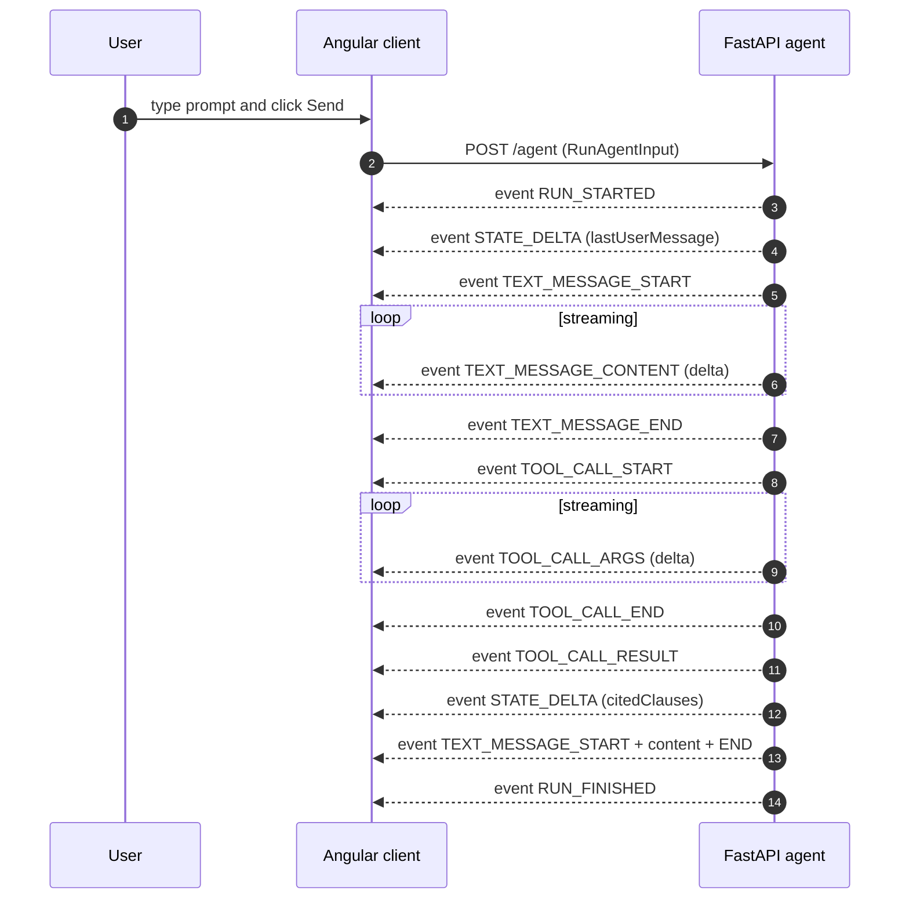

# Architecture

This document explains the demo's runtime architecture and the reducer mapping
between AG-UI Protocol events and the Angular signal-based state.

## High-level component view

## Request/response sequence

## Event-to-signal reducer

The `AgentService` consumes the SSE byte stream, parses each frame, and reduces
each AG-UI event into the following signals:

| AG-UI event              | Signal updated                | Effect                                                |
| ------------------------ | ----------------------------- | ----------------------------------------------------- |
| `RUN_STARTED`            | `status`                      | set to `'running'`                                    |
| `RUN_FINISHED`           | `status`                      | set to `'finished'`                                   |
| `RUN_ERROR`              | `status`, `error`             | `'error'` + error message                             |
| `TEXT_MESSAGE_START`     | `messages`                    | append new message with empty content, `pending=true` |
| `TEXT_MESSAGE_CONTENT`   | `messages`                    | concatenate `delta` to the matching message           |
| `TEXT_MESSAGE_END`       | `messages`                    | mark matching message as `pending=false`              |
| `TOOL_CALL_START`        | `toolCalls`                   | insert new ToolCall with `status='running'`           |
| `TOOL_CALL_ARGS`         | `toolCalls`                   | concatenate args delta to the matching ToolCall       |
| `TOOL_CALL_END`          | `toolCalls`                   | set `status='finished'`                               |
| `TOOL_CALL_RESULT`       | `toolCalls`                   | set `status='completed'` + populate `result`          |
| `STATE_SNAPSHOT`         | `agentState`                  | replace entire object                                 |
| `STATE_DELTA`            | `agentState`                  | apply JSON-Patch operations                           |

## Why we do not use `EventSource`

The browser's `EventSource` API only supports `GET` requests. AG-UI uses
`POST + SSE` to allow a structured `RunAgentInput` payload, which means we have
to consume the SSE stream via `fetch()` + `ReadableStream` and parse the wire
format manually. The parser in `agent.service.ts` handles:

- Frame boundaries (`\n\n`)
- `event: <name>` and `data: <json>` lines
- Multi-line `data:` continuations (concatenated)
- Comment lines starting with `:` (skipped)
- Stream-level partial frames buffered across reads

## Why we apply JSON-Patch manually

`STATE_DELTA` events carry [RFC 6902](https://www.rfc-editor.org/rfc/rfc6902)
JSON-Patch arrays. The demo only emits `add` / `replace` operations on top-level
paths, so the patcher in `agent.service.ts` covers a tiny subset by hand. In
production code, a real JSON-Patch library such as `fast-json-patch` should be
used to support nested paths, `move`/`copy`/`test`, and proper error semantics.

## Zoneless change detection

The Angular app uses `provideZonelessChangeDetection()` from `@angular/core`.
Without Zone.js, signal updates are the *only* trigger for change detection.
This makes the SSE consumer particularly clean: every `.update()` or `.set()`
call on a signal causes Angular to re-render exactly the affected templates.

## Streaming Resource API

In a follow-up iteration, the manual `fetch()` reducer in `agent.service.ts`
could be wrapped in Angular 20's experimental `streamingResource()` to expose
the stream as a `Resource<Message[]>` with native `status` / `error` /
`isLoading` signals. The current implementation keeps the reducer explicit so
it is easy to audit the wire format and reducer behaviour.
