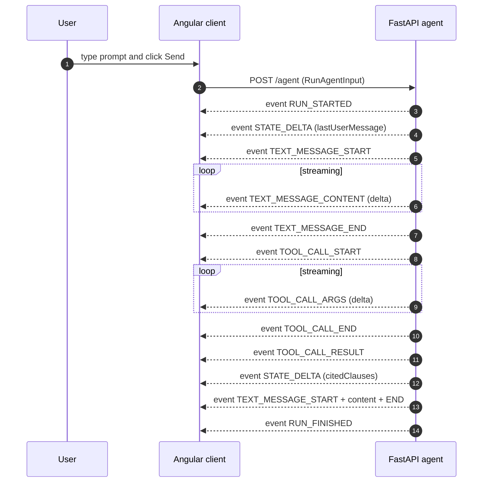

# Architecture

This document explains the demo's runtime architecture and the reducer mapping
between AG-UI Protocol events and the Angular signal-based state.

## High-level component view

```mermaid
flowchart LR
    subgraph Browser
        UI[ChatComponent<br/>zoneless + signals]
        Service[AgentService<br/>signals glue + AgentSubscriber]
        Http[HttpAgent<br/>&#64;ag-ui/client]
        UI -->|reads signals| Service
        Service -->|subscribes| Http
    end
    subgraph Server
        FastAPI[FastAPI<br/>POST /agent]
        Events[events.py<br/>AG-UI builders]
        FastAPI --> Events
    end
    UI -->|sendMessage| Service
    Http -->|fetch POST<br/>Accept text/event-stream| FastAPI
    FastAPI -->|StreamingResponse<br/>SSE frames| Http
```

The transport, SSE parsing, event-sequence verification (`verifyEvents`) and
shared-state reduction live in `@ag-ui/client`'s `HttpAgent`. `AgentService` is a
thin layer that registers an `AgentSubscriber` and mirrors the agent's streamed
events and reduced state into Angular signals.

## Request/response sequence

## Event-to-signal reducer

`AgentService` registers an `AgentSubscriber` on the `HttpAgent` and maps each
streamed event (and the agent's reduced state) into the following signals. The
handler column names the `AgentSubscriber` callback that performs the update:

| AG-UI event              | Subscriber callback          | Signal updated    | Effect                                                |
| ------------------------ | ---------------------------- | ----------------- | ----------------------------------------------------- |
| `RUN_STARTED`            | `onRunStartedEvent`          | `status`          | set to `'running'`                                    |
| `RUN_FINISHED`           | `onRunFinishedEvent`         | `status`          | set to `'finished'`                                   |
| `RUN_ERROR`              | `onRunErrorEvent`            | `status`, `error` | `'error'` + error message                             |
| `TEXT_MESSAGE_START`     | `onTextMessageStartEvent`    | `messages`        | append new message with empty content, `pending=true` |
| `TEXT_MESSAGE_CONTENT`   | `onTextMessageContentEvent`  | `messages`        | concatenate `delta` to the matching message           |
| `TEXT_MESSAGE_END`       | `onTextMessageEndEvent`      | `messages`        | mark matching message as `pending=false`              |
| `TOOL_CALL_START`        | `onToolCallStartEvent`       | `toolCalls`       | insert new ToolCall with `status='running'`           |
| `TOOL_CALL_ARGS`         | `onToolCallArgsEvent`        | `toolCalls`       | concatenate args delta to the matching ToolCall       |
| `TOOL_CALL_END`          | `onToolCallEndEvent`         | `toolCalls`       | set `status='finished'`                               |
| `TOOL_CALL_RESULT`       | `onToolCallResultEvent`      | `toolCalls`       | set `status='completed'` + populate `result`          |
| `STATE_SNAPSHOT` / `STATE_DELTA` | `onStateChanged`     | `agentState`      | mirror the agent's already-reduced `state` object     |

Note the difference from the previous hand-rolled reducer: `STATE_DELTA`
JSON-Patch is **no longer applied in app code**. `HttpAgent` applies the patch to
its internal `state` (via `fast-json-patch`) and fires `onStateChanged`; the
service simply copies the reduced object into the `agentState` signal.

## Why `@ag-ui/client` `HttpAgent` (not `EventSource`, not a hand-rolled parser)

The browser's `EventSource` API only supports `GET` requests. AG-UI uses
`POST + SSE` to carry a structured `RunAgentInput` payload, so the stream has to
be consumed via `fetch()` + `ReadableStream`. An earlier iteration of this demo
parsed that wire format by hand (frame boundaries, `event:`/`data:` lines,
multi-line `data:` continuations, partial frames across reads) and applied
JSON-Patch by hand. The S2 spike replaced all of that (~250 lines) with the
first-party `@ag-ui/client` `HttpAgent`, which provides:

- the POST + SSE transport (with a `fetch` we bind to `window` so its `this` is
  correct under zoneless Angular — a detached `fetch` throws "Illegal
  invocation");
- event-sequence verification (`verifyEvents`);
- [RFC 6902](https://www.rfc-editor.org/rfc/rfc6902) JSON-Patch state reduction
  via `fast-json-patch` — supporting nested paths and full op semantics, not the
  tiny `add`/`replace` subset the hand-rolled patcher covered.

`AgentService` keeps only the Angular-specific concern: subscribing and mirroring
into signals. The hand-rolled parser remains in git history as an escape hatch if
the pre-1.0 SDK stalls.

## Zoneless change detection

The Angular app uses `provideZonelessChangeDetection()` from `@angular/core`.
Without Zone.js, signal updates are the *only* trigger for change detection.
This makes the SSE consumer particularly clean: every `.update()` or `.set()`
call on a signal causes Angular to re-render exactly the affected templates.

## Streaming Resource API

In a follow-up iteration, the `HttpAgent` run in `agent.service.ts` could be
wrapped in Angular 20's experimental `streamingResource()` to expose the stream
as a `Resource<Message[]>` with native `status` / `error` / `isLoading` signals.
The current implementation keeps the subscriber explicit so the mapping from
AG-UI events to signals is easy to audit.
