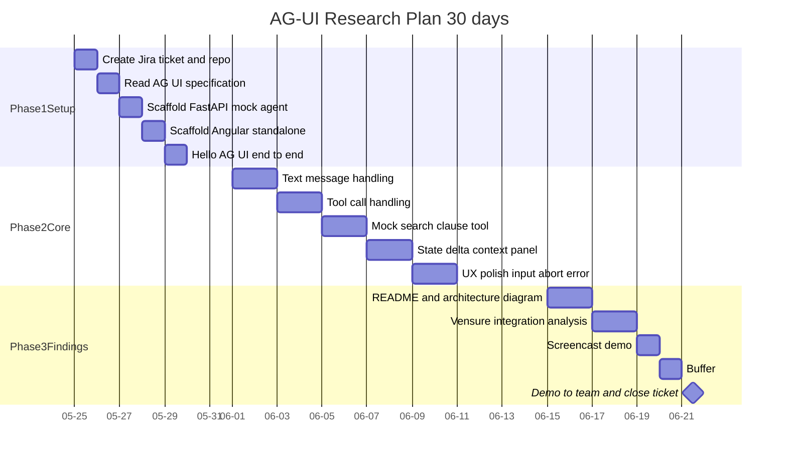

# AG-UI Protocol + Angular 20 cliente para el Chat de Vensure

> **Obsoleto — referencia histórica.** El plan vigente es
> `docs/sprint-7-sessions.md` (sprint comprimido de 7 sesiones hacia el demo del
> 2026-06-22). Además, la comparación "AG-UI vs el WebSocket actual" mencionada
> abajo usa un baseline equivocado: el chat real hoy es **REST síncrono + gRPC**
> (VN-54), no WebSocket — `/api/v1/ws` es para jobs de documentos. El análisis
> corregido vive en `docs/vensure-integration.md`.
>
> Plan original de investigación. Generado en sesión de planeación y movido al
> repositorio como referencia. La sesión 1 completó: ticket Jira en TR, repo
> en GitHub y scaffold local de `apps/api` (FastAPI) y `apps/web` (Angular 20).
> Las fases 1–3 (`Hello AG-UI` verificado en runtime, eventos core, hallazgos)
> continúan en la próxima sesión.

## Estado actual (al cierre de la sesión 1)

- [x] Ticket Jira creado: [TR-306](https://creai.atlassian.net/browse/TR-306) (Historia, prioridad Medium, asignado).
- [x] Repositorio creado: <https://github.com/fenimorebaena-creai/creai-techresearch-ag-ui-angular>.
- [x] Scaffold local: `apps/api/` (FastAPI + builders AG-UI), `apps/web/` (Angular 20 standalone, zoneless, signals), `docs/architecture.md`, `docs/vensure-integration.md`, `LICENSE` MIT, `Makefile`, `scripts/dev.sh`.
- [ ] Verificar `make dev` end-to-end con `npm install` + `pip install -e` en una máquina con Node 20.19+ y Python 3.12+.
- [ ] Pulir UX (estados de error reales, loading skeleton, abort).
- [ ] Grabar screencast 2–3 min.
- [ ] Demo al equipo y transición de TR-306 a `Finalizada`.

## Resumen ejecutivo

Investigar y prototipar el uso del **AG-UI Protocol** (Agent-User Interaction, open-source, adoptado en 2026 por Google, Microsoft, LangChain, AWS, CrewAI, Mastra) y su **cliente oficial Angular** publicado por CopilotKit, para alimentar el tab **Chat** del Labor Relations frontend que hoy está mockeado. El backend AG-UI se prototipa como un endpoint **SSE en FastAPI** que emite eventos AG-UI; el frontend los consume con la nueva **Streaming Resource API** de Angular 20 + Signals.

- AG-UI specification & SDK: [`github.com/ag-ui-protocol/ag-ui`](https://github.com/ag-ui-protocol/ag-ui), docs: [`docs.ag-ui.com`](https://docs.ag-ui.com)
- CopilotKit (mantenedor del protocolo y cliente Angular): [`github.com/CopilotKit/CopilotKit`](https://github.com/CopilotKit/CopilotKit)
- Angular 20 `httpResource` + streaming resource (estables en v20): [`packages/core/src/resource/api.ts`](https://github.com/angular/angular/blob/main/packages/core/src/resource/api.ts)

## Presupuesto de tiempo

- **Calendario:** 30 días, lunes a viernes = ~22 días hábiles × 1 h/día = 22 h totales.
- **Tiempo efectivo planeado:** la mitad para holgura → **~11 h reales de trabajo**, ~30 min efectivos/día promedio. El resto absorbe imprevistos (reuniones, bloqueos, depuración).
- Plan dimensionado para terminar con presentación lista en día 22 y dejar días 23–30 como margen real adicional.

## Objetivos

1. **Entender** la especificación AG-UI (los ~16 tipos de evento, transporte HTTP+SSE, ciclo `RunAgentInput` → stream tipado).
2. **Prototipar** un agente mínimo en FastAPI que emite eventos AG-UI sobre SSE, con al menos un *tool call* simulado de dominio Labor Relations (p.ej. `search_cba_clause`).
3. **Consumir** ese stream desde un componente Angular 20 standalone usando `httpResource`/`streamingResource` + Signals, mostrando: texto incremental, progreso de tool call, estado de error/loading.
4. **Documentar hallazgos**: viabilidad de integrar AG-UI en `creai_labor-relations-front`, gaps vs el patrón actual de WebSocket, decisión recomendada (adoptar / investigar más / archivar).

Criterios de aceptación (mirroreables al ticket Jira):

- [ ] Demo end-to-end corre con `make dev` (FastAPI + Angular) y muestra streaming token a token.
- [ ] Al menos 1 *tool call* visible en la UI con estado intermedio y resultado final.
- [ ] README con arquitectura, eventos cubiertos, decisión, y comparación AG-UI vs el WebSocket actual de Vensure.
- [ ] Repo público, ticket Jira en estado `Finalizada`, demo grabada (screencast corto) o presentación al equipo.

## Fuera de alcance

- No se integra al monorepo `creai_labor-relations-front` ni al microfrontend single-spa.
- No se reemplaza el backend real: el agente FastAPI es un mock pedagógico, no usa OpenAI ni los servicios gRPC reales.
- No se hace deploy ni K8s; todo corre localmente.
- No se cubren los 16 tipos de evento AG-UI; sólo los core para chat + tools.

## Fases (3)

### Fase 1 — Setup & "Hello AG-UI" (Semana 1, días 1–5, ~2.5 h efectivas)

Objetivo: tener el repo, el ticket y un end-to-end mínimo "el agente dice hola en streaming".

- Día 1 (~30 min): **Crear ticket Jira en TR** (primer entregable, ver sección abajo) y **crear repo GitHub** `<handle>-creai/creai-techresearch-ag-ui-angular` con `README.md` skeleton, `.gitignore` Node + Python, licencia MIT.
- Día 2: Lectura focalizada del AG-UI spec (sólo: `RunAgentInput`, eventos `TEXT_MESSAGE_START/CONTENT/END`, `RUN_STARTED/FINISHED`, transporte SSE via `HttpAgent`).
- Día 3: Scaffold `apps/api/` con FastAPI + uvicorn; endpoint `POST /agent` que devuelve `StreamingResponse` SSE con eventos AG-UI hardcodeados.
- Día 4: Scaffold `apps/web/` con `ng new` Angular 20 standalone + zoneless + signals; agregar `@copilotkit/angular` (o consumir AG-UI client JS directo si el paquete Angular no expone lo necesario).
- Día 5: Wire end-to-end: Angular dispara `RunAgentInput` → ve mensaje streameado en consola y en un `<pre>{{messages()}}</pre>`.

### Fase 2 — Eventos core + caso Vensure (Semanas 2–3, días 6–15, ~5 h efectivas)

Objetivo: chat funcional con tool call temático de Labor Relations.

- Días 6–7: Manejo de `TEXT_MESSAGE_*` con `signal<Message[]>` + ChangeDetection OnPush.
- Días 8–9: Manejo de `TOOL_CALL_START/ARGS/END` + `TOOL_RESULT`; mostrar pill "Searching CBA…" mientras corre.
- Días 10–11: Mock tool `search_cba_clause` en FastAPI: simula latencia, retorna fragmento JSON.
- Días 12–13: Manejo de `STATE_DELTA` para una vista lateral tipo "context panel" que se actualiza incrementalmente (p.ej. clauses citadas).
- Días 14–15: UX polish — input de usuario, abort/stop, error state, loading skeleton. Estilo minimal con Tailwind o Angular Material 3.

### Fase 3 — Hallazgos, comparativa y presentación (Semana 4, días 16–22, ~3.5 h efectivas)

Objetivo: dejar el repo presentable y producir el documento de decisión.

- Días 16–17: README completo: arquitectura (mermaid), eventos cubiertos, cómo correr, screenshots.
- Días 18–19: **Sección "Vensure integration analysis"** en el README: tabla comparativa AG-UI vs el WebSocket actual de `creai_labor-relations` (auth, reconnect, multi-replica, tipado, polyglot, ecosystem). Citar `docs/backend/08-open-questions.md` (WebSocket sin auth, sin catch-up).
- Día 20: Screencast de 2–3 min mostrando el flujo.
- Día 21: Buffer / pulido final.
- Día 22: Cerrar el ticket en `Finalizada`, agendar demo de 15 min con el equipo.

## Cronograma (calendario)



Versión equivalente como lista (en caso de que el render de Mermaid falle):

- **Phase 1 — Setup (días 1–5, 2026-05-25 → 2026-05-29)**
  - Día 1: crear ticket Jira y repo GitHub
  - Día 2: leer especificación AG-UI
  - Día 3: scaffold FastAPI mock agent
  - Día 4: scaffold Angular 20 standalone
  - Día 5: Hello AG-UI end-to-end
- **Phase 2 — Core events (días 6–15, 2026-06-01 → 2026-06-12)**
  - Días 6–7: manejo de eventos de mensaje (TEXT_MESSAGE_*)
  - Días 8–9: manejo de tool calls (TOOL_CALL_*)
  - Días 10–11: mock tool `search_cba_clause`
  - Días 12–13: STATE_DELTA + context panel
  - Días 14–15: UX polish (input, abort, error)
- **Phase 3 — Findings (días 16–22, 2026-06-15 → 2026-06-23)**
  - Días 16–17: README + diagrama de arquitectura
  - Días 18–19: análisis de integración con Vensure
  - Día 20: screencast demo
  - Día 21: buffer
  - Día 22: demo al equipo + cerrar ticket

## Estructura del repositorio

Repo: <https://github.com/fenimorebaena-creai/creai-techresearch-ag-ui-angular> (convención del board, ej. `carlosvilla-creai/sentiment-smithy-lab`).

Layout actual:

```text
creai-techresearch-ag-ui-angular/
├── README.md                       # overview + quick start
├── LICENSE                         # MIT
├── .gitignore                      # Node + Python + Angular
├── apps/
│   ├── api/                        # FastAPI minimal AG-UI emitter
│   │   ├── pyproject.toml
│   │   ├── src/main.py             # POST /agent SSE endpoint
│   │   ├── src/events.py           # AG-UI event types + builders
│   │   └── tests/test_agent_stream.py
│   └── web/                        # Angular 20 standalone client
│       ├── angular.json
│       ├── package.json
│       └── src/app/chat/           # ChatComponent + AgentService + types
├── docs/
│   ├── architecture.md             # mermaid + flow + reducer table
│   ├── vensure-integration.md      # comparativa + decisión recomendada
│   └── research-plan.md            # este archivo
├── scripts/dev.sh                  # arranca api+web en paralelo
└── Makefile                        # make dev / make test / make demo
```

## Primer entregable — Ticket Jira (creado en proyecto TR)

- **Proyecto:** `TR` (Technical Research) en `creai.atlassian.net`
- **Ticket:** [TR-306](https://creai.atlassian.net/browse/TR-306)
- **Tipo:** `Historia`
- **Prioridad:** `Medium`
- **Assignee:** `fenimorebaena@creai.mx`
- **Estado inicial:** `Backlog` (transición a `IN PROGRESS.` al iniciar Fase 1)

**Título (en inglés, alineado con el board):**

> `AG-UI Protocol + Angular 20: streaming agent client for the Labor Relations Chat`

**Descripción (markdown, en inglés, alineada con el estilo de TR-298 / TR-285):**

```markdown
**AG-UI Protocol + Angular 20**
Open, event-based protocol (HTTP + SSE) for streaming agent-to-frontend
interaction, released in 2025 and adopted in 2026 by Google, Microsoft,
LangChain, AWS, CrewAI and Mastra. CopilotKit publishes a first-party
Angular client built on Angular 20 Signals + the new Streaming Resource API.

**Goal:** evaluate whether AG-UI is a viable transport for the mocked Chat
tab in `creai_labor-relations-front` and the future Labor Relations
Assistant, and produce a working Angular 20 demo that consumes AG-UI
events from a minimal FastAPI emitter.

**Scope (out-of-tree research repo, not integrated into the MF):**

* FastAPI mock agent emitting AG-UI events over SSE
* Angular 20 standalone client (zoneless, signals)
* Coverage of `TEXT_MESSAGE_*`, `TOOL_CALL_*`, `STATE_DELTA`, `RUN_*` events
* One Labor-Relations themed tool call (`search_cba_clause`)
* Comparison vs the current WebSocket pattern in `creai_labor-relations`

**Acceptance Criteria:**

- [ ] Demo runs end-to-end with `make dev`
- [ ] At least 1 tool call visible with intermediate + final state
- [ ] README with architecture diagram and event coverage
- [ ] Decision log: adopt / investigate further / park
- [ ] Short screencast (2–3 min)

**Repository:** https://github.com/fenimorebaena-creai/creai-techresearch-ag-ui-angular

**Refs:**

* AG-UI: https://github.com/ag-ui-protocol/ag-ui
* CopilotKit: https://github.com/CopilotKit/CopilotKit
* Angular Resource API: https://github.com/angular/angular/blob/main/packages/core/src/resource/api.ts
```

## Guardrails operativos

- Repo personal independiente, no toca el workspace `vensure`. No aplica la convención `feat/VN-<ID>` del workspace; trabajo directo sobre `main` con commits convencionales (`feat:`, `docs:`, `chore:`) está OK para un repo de research individual.
- Toda la documentación, código, commits y el ticket en **inglés** (regla `language-standard`).
- Nada de force-push ni cambios remotos sin confirmación explícita.
- Antes de ejecutar: confirmar handle de GitHub y correo Creai (para el `assignee` del ticket Jira), confirmar nombre exacto del repo.
